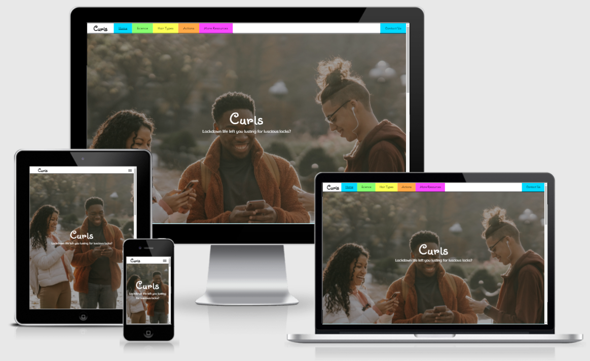
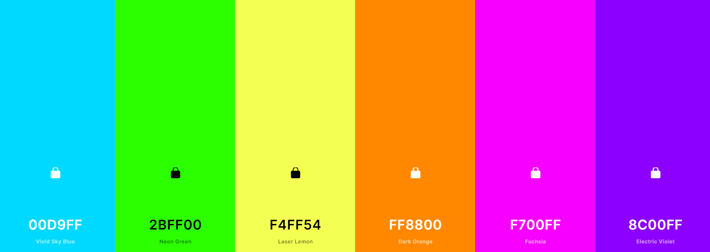
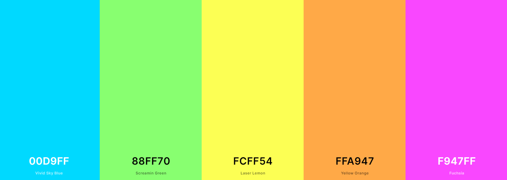
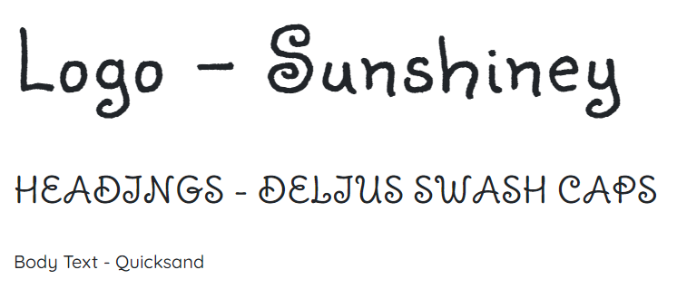
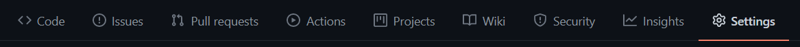
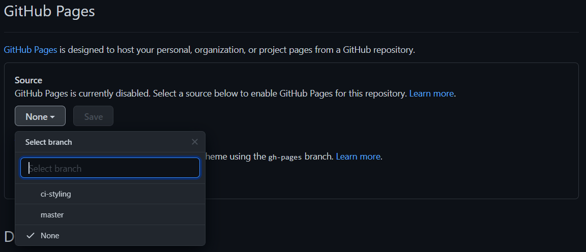

# **Curls**

# Overview

An easily accessible basic resource for people looking for information about haircare methods specific to curly hair. Changes in fashion and greater acceptance of individuality mean more people are able to wear naturally curly hair in a professional environment as well as in other situations in which it would have previously been considered inappropriate.

Decades of straightening, blow-drying and otherwise taming or conatining curls have meant that information about curly haircare is thin on the ground, and what there is is very spread out.  This website aims to pull together all of the basic information a curly converter might need to get started, and then provide them with links for further reading should they need or want it.

# Index
1. [UX](#ux)
    * [User Stories](#user-stories)
    * [Strategy](#strategy)
    * [Scope](#scope)
    * [Structure](#structure)
    * [Skeleton](#skeleton)
    * [Surface](#surface)
1. [Features](#features)
    * [Existing Features](#existing-features)
      * [Home](#home)
      * [Science](#science)
      * [Types](#types)
      * [Actions](#actions)
      * [More Info](#more-info)
      * [Contact](#contact)
      * [404](#404)
    * [Features for Future Implementation](#features-for-future-implementation)
1. [Testing](#testing)
1. [Development Life Cycle](#development-life-cycle)
1. [Technologies Used](#technologies-used)
1. [Deployment](#deployment)
    * [Via GitPod](#deployment-of-the-page)
    * [Cloning Locally](#how-to-run-the-code-locally)
1. [Credits](#credits)
    * [Website](#website-credits)
    * [README](#readme-credits)

Note, testing information can be found in a separate document:
* [Testing](TESTING.md)

## UX

### **Overview and Broad Design Choices**
Adopters of curly specific haircare do tend to be female and younger, however this is rapidly changing as male grooming becomes more mainstream, and personal freedoms become more acceptable for all generations.  The users of this website therefore could be anybody, regardless of age or gender and the design is approached accordingly.
*  Bright unisex colours are offset by classic, largely white sections and black/white text and details.
*  Soft scrolling fonts are contrasted with sharp, angled corners and straight lines.
*  Imagery is fairly inclusive, although it was not possible to find suitable pictures of older people with spectacular natural curly hair.

### **User Stories**
1. As a new user, I want to quickly determine if the website contains information I need, so that I know quickly whether to stay on the page.
1. As a new user, I want to easily determine and navigate to a point on the website which is appropriate for my existing knowledge, so that I do not waste time.
1. As a new user, I want to learn about basic techniques that I can use right away, so that I can start putting research into action.
1. As a returning user, I want to determine my hair type and porosity, so that I can tailor the techniques I learned before.
1. As a returning user, I want to be able to easily contact the site owners with questions, so that I can obtain tailored information or troubleshoot issues.
1. As a frequent user, I want to be able to navigate quickly and easily to the relevant part of the website which contains the information I need, so that I can quickly fulfil the reason for my visit.

These stories are addressed fully in the [Testing](TESTING.md) document.

### **Strategy**
This website is for individuals looking for information to help them decide whether curly haircare is for them, and if it is, identify the characteristics of their hair and what their first steps might be.

The Curls website satisfies these objectives by first presenting a summary of the information contained within the various sections of the website, before expanding on each summary with clear progression to a dedicated page. As the user works through the pages they will gain an understanding of their hair and how it is affected by products and practices before arriving at links to further learning.

Owner aims:
* Inspired/informed user
* Increase awareness of curly haircare
* Provide basic information on such
* Grow the curly haircare community
* Potential for commissions or sponsored links in the future

User aims:
* Get better curls
* Increase knowledge
* Easily progress through basic details to more in depth information as understanding improves
* Identify hair type and porosity
* Learn where to find information specific to indentified hair type

### **Scope**
The project is born of the creators own experience trying to find information on how to get defined, glossy curls.  There was lots and lots of information but all scattered about, and nothing aimed directly at a beginner.

The scope of the project therefore is to provide condensed, basic information which can give the user the tools they need to get started.

#### Feature Viability

# | Feature | Importance | Viability | Comment 
---|------------ | -------------|--------------|-----------|
1.| Identify curl type  | 5 | 5 | Y - Important for care routine
2.| Identify porosity | 5 | 5 | Y - Important for care routine
3.| Identify hair type | 2 | 4 | N - Advanced concept, research needed
4.| Table porosity/curl type do's and dont's | 4 | 2 | N - Too big to easily make responsive
5.| Hair type needs and routines | 5 | 3 | N - Bulky text heavy sections
6.| Links to further reading | 3 | 5 | Y - Assist with research beyond current scope of website
7.| Indicative starter products by type/porosity | 4 | 1 | N - Products change regularly, research needed
T.| Total score | 28 | 25 |

#### Feature Plan
First increment:
* Identify type & porosity
* Understand type & porosity
* Understand actions to take (creep risk)
* Links to further research

Second increment:
* Add type routines
* Add product information

Third increment:
* Add type/porosity table

### **Structure**
* See Information Grouping [mind map here](assets/documents/structure.pdf).

### **Skeleton**
In line with structure planning, a clear and concise homepage is designed in line with standard expectations, linking immediately to all parts of the site.  Each page also allows logical progression to effectively build knowledge.

Each page broken down into small sections for easy digest of information.

Very basic 404 redirect page with a link to home to prevent stuck users.

#### Wireframes

##### Original
1. [Mobile](assets/documents/curls-mobile.pdf) 375px
1. [Tablet](assets/documents/curls-tablet.pdf) 768px
1. [PC/Laptop](assets/documents/curls-pc.pdf) 1200px

##### Final
1. [Mobile](assets/documents/curls-mobile-final.pdf) 375px
1. [Tablet](assets/documents/curls-tablet-final.pdf) 768px
1. [PC/Laptop](assets/documents/curls-pc-final.pdf) 1200px

##### Summary of Changes
The most notable change between the original wireframes and the final version is the footer.  The original design felt very disconnected to the flow of the page, and almost unfinished when viewed in its final environment.  Other top-level changes are the exchange of in-line text links for bolder, more obvious call to action buttons, the use of collapsed nav in hamburger button format on tablet and the elimination of underlines, horizontal and vertical rules.

*  The four panel structure of the footer was revised, in particular eliminating the contact section.  This had contained a telephone number and email address and a link to a contact form modal.  No address was included as it is not relevant to the content.  The phone number and email address were vulnerable to misuse, either by bots or malicious users and the Contact Us page was so readily accessible that the modal was deemed surplus to requirements.  It was also felt that the modal did not fit well with the overall feel of the site.
*  The links to the next pages were somewhat lost in the volume of content on each page, particularly the homepage which has snippets of information about each following segment.  As such, these were changed to bolder, clearer buttons which focus the user per the intent of the designer, which is to move onto the next learning section.
*  The navigation bar link items proved to be too large for the tablet view when spacing between nav elements was optimised.  As such, the decision was made to collapse to a hamburger menu at tablet, rather than make the elements fit and appear squashed.
*  All pages have a lot of content, in line with the nature of the website.  The inclusion of decorative elements cluttered the pages and made for an uncomfortable viewing experience.
*  Source data links have been acknowledged in the README, the vast majority of content is taken from knowledge already held by the creator, verified by the external sources.  The links made the pages very bitty and unattractive.

###### Changes Specific to Home Page
*  Section 2 was very busy, so the background image was eliminated and the content condensed into a smaller number of sections.
*  Section 4 was very spaced out and clunky.  The arrangement made it appear dated.  This was tweaked slightly to make use of Bootstrap cards to present the information in a more contained manner.
*  Added a Get Started section, as user was otherwise left at the end of the page with a link to the last section.

###### Changes Specific to Science Page
*  None.

###### Changes Specific to Types Page
*  Section 1 did not follow a logical reading order of left to right and then down, and was amended as such.

###### Changes Specfic to Actions Page
*  Section 2 contains a vast amount of content which was overwhelming, particularly on tablet and mobile.  A Bootstrap Accordion component was used to separate the text into digestible segments.  A video was embedded here to help further break up the textual content.

###### Changes Specific to More Page
*  None.

###### Changes Specific to Contact Page
*  Remove Fieldset and Legend from form, page appeared cluttered and bitty as the appearance was very different to the other sections thorugh out the webpage.

### **Surface**

#### Colours
Haircare and beauty in general can be perceived as a feminine area of interest, when in reality it is simple self-care.  A selection of bright colours across the spectrum were chosen to give an androgynous feel, a nod to LGBTQA users and complement a plain white background.  The very simplistic design is to allow the information to speak for itself as this is the main purpose of the website, and to keep the data easily digestible by the user.

Once put to use, it became apparent that the boldness of the chosen colours did not work well for large block sections on the web pages.  This slightly more muted palette was chosen to make using the site more comfortable but still keep a quirky, friendly feel.

#### Typography
Three fonts are chosen for the website, all via Google Fonts.
1. A fun and whimsical cursive font for the logo: "Sunshiney"
1. A similar but easier to read cursive font for headings through the page, and for navigation links: "Delius Swash Caps"
1. Finally, a simple sans-serif font for the body to facilitate easy reading.  Sans-serif fonts render well on lower resulution screens, and are generally considered more readable by those affected by dyslexia or similar reading difficulties: "Quicksand"

## Features

### **Existing Features**
Uniform design across all pages in line with conventional practice.  This incorporates:
* A sticky navigation bar which collapses to hamburger menu on mobile and tablet, with the Logo on the left and a stand-out Contact item on the right.  This allows quick and easy navigation of the website.
* A footer which provides a mission statement and design information, and social media links.  This provides a certain and familiar endpoint to every page.
* Consistent, defined design across information delivery sections of the website.  This allows intuitive use of the website through familiarity.
* Every page starts with a hero image, to elicit a positive emotional response.
* The website is designed to be bright and clean with the focus on the information itself.  This allows the user to fulfil their purpose of obtaining knowledge without distraction.
* Androgynous design is deliberately chosen as the content is traditionally seen as feminine.  This helps users who identify as other than female to feel comfortable using the site.
* Colours for each page are tied to the colour of the related navigation bar component to assist with centering.
* Every page has at least one internal link near the bottom of the page to avoid users becoming "trapped", and to encourage them on their journey through the website.
* The Contact Us part of the navigation bar is displayed proudly on the right of the page.  This allows the user to easily access help or tailored information from anywhere on the site.

#### Home
The page features a relevant full screen hero image to provide positive emotional response and visual validation that the user is in a location which meets their needs.

The page then contains very short snapshots of all of the information contained in following pages.  These sections are clearly structured to relate directly to the links in the navigation bar and coloured accordingly.  This serves multiple purposes:
1. It allows the user to quickly determine if the website contains the information they are looking for.
2. It allows the user to quickly identify which part of the website contains the information that they are looking for, and a means to navigate to it easily.

#### Science
The page also opens with a relevant hero image, though this is not quite full screen to allow "peeping" to encourage the user to scroll to the information below.

Information is presented in short, defined sections to prevent user fatigue and these are structured consistently with the sections on the home page to provide a familiar, comfortable experience.

Diagrams are used to provide a visual representation of the data provided and help facilitate understanding.

The bottom of the article contains a link to the next page in the logical progression of the website.

#### Types
This page mirrors the Science page in layout to provide a secure, intuitive experience for the user.  Sections are once again defined in short digestible chunks and supported by visual aids.  The page again, ends with a link to the next page in the sequence.

#### Actions
As with the Science and Types pages, design remains focussed on provision of information in small defined sections.  Icons and Bootstrap accordion components are used to provide graphic relief from large bodies of text and introduce splashes of colour.  These are used in place of the diagrams shown in previous sections which do not apply here and help to keep the consistency of design by maintaining the presence of small images amongst the body.  Embedded video provides further relief from a particularly text-heavy page.  A link encourages the user to the next page just before the footer.

#### More Info
Still following the design of the previous pages, clear and defined information sections are provided, here also relieved by the use of icons to break up the text content.  A link to the Contact Us page encourages the user to engage further.

This is where the content of the website ends.  In line with the purpose of the owner to grow the community, links to external resources which provide further, more specific information are provided here with descriptions of what can be found at each.

#### Contact
A large image is shown at the top of the page to provide continuity with the rest of the website.  A contact form is provided to encourage users to engage with the community, which will help with retention rates.

#### 404
A custom 404 page was included to try and prevent user loss through becoming stuck at a dead end with a browser generated 404 page, or the GitHub standard 404 page.  The custom page includes the standard Nav and Footer as shown on all other pages so that the user can navigate to their desired destination direct from the 404 page.

The page also features a smaller hero image, of sorts (60% vh rather than the 80% used on other pages and 100% used on the home page) to keep page consistency and provide a little humour.  The image is a slightly confused looking curly sketch who peeks into the image on PC, and is shown in full on tablet and mobile.

The smaller "hero" image is to allow the 404 error and an immediate redirection to the homepage to display without the need to scroll.

### **Features for Future Implementation**
1. Connect contact form to email | Requires Javascript.
1. Add pages for type specific care, to be accessed via a hair type sorter | Time constraints and technical knowledge both prevent this item from progressing at this time.
1. Add pages for type specific haircare products, possibly with sponsored links | Time constraints prevent addition of more in-depth pages at this time.  Lack of industry contacts prevent the addition of sponsored links.
1. Include GDPR information with regard to use of data submitted in the form etc.
1. Gallery, possibly from user submissions.

## Testing

This information is held in the [Testing](TESTING.md) file.

## Development Life Cycle

This section is to provide an brief insight into how the approach to the code structure of the website was expected to work, what changed and why, and then to summarise how the creator would now approach replicating the project.

Changes to design are documented in the [UX section](#ux) under [wireframes](#wireframes).

The project was deployed using GitHub pages once the basic structure of the page was complete.  This allowed for continuous delivery as each change was made, and pushed.

Commits were made as each section of each page was added and pushed once a section was complete.

A number of commits made had insufficient or ambiguous information, these are listed and clarified in the table below:

### **Clarified Commits**

Commit Ref | Original message | Revised message
--- | --- | ----
20c7332d8fece7ec9c2c1ebd483ff1964b7fccfc | Update H S1 responsivity to remove mid text on tablet. | Update Home Section 1 to remove text on tablet.
878f7c69a2845a06f1accadc6f000e7681f7cc20 | Format H S3. | Format Home section 3.
8ab902e78b50e6b1147b5033e1e1734ffb921c4b | Add H S3 icons. | Add Home section 3 icons.
387fa925da503db2ea09ec9f4f02454b6d66ff5e | Style H S3. Re-colour home theme. | Style Home section 3. Re-colour home theme.
08354b97a6624baaf5a8691adf6e4b62e8d5c640 | Style H S4. Reclassify spacer classes. | Style Home section 4. Reclassify spacer classes.
1c76c23f692f7b076efd9b86fd5aef33ed590832 | Add H S4 link paragraph. | Add Home section 4 link paragraph.
58af65fa9f428fb0edae00ced3dd60a76e1ed8ef | Attempt responsive columns S S1. | Attempt responsive columns Science section 1.
8f244c1329aef320c9cc4a54d5c0f521cb325c31 | Update S S1 styling. | Update Science section 1 styling.
a79c76089d2d69b844d5ac8632fe0cf4e118d9a5 | Style T S1. | Style types section 1.
42c9ed2fbcdf915c949f73c84281e5aaf2110571 | Correct tablet A S1 alignment. | Correct tablet Actions section 1 alignment.
cab611e13dc5bb49cab26032c0027177fc52090e | Add More S1. | Add More Info page section 1.
79172cb91990298a312aea8d1557f3141c6041fb | Add more S2. | Add More Info page section 2.
254af1a0556ab2ec800fb97d0c2f1065e68a38e4 | Add More S3. | Add More Info page section 3.

### **Reflections on General Approach to Build**
The preparation and build plan for the project was methodical and modular, with the intention of building one thing at a time and using previous code as a template for other similar parts of the website.  To a greater extent this was achieved, but a number of early build sections had to be re-written, some a number of times, as shown in the commit history.  Greater understanding of the concepts to be used would avoid this.  The preparation and user/owner research did provide a solid foundation to work from and an excellent focus for direction in resolving issues. This approach will be repeated, along with the use of a kanban board or GitHub projects area.

Overall commits are short, concise and descriptive.  Most commits are made in the style "Change in","Page name","Section number".  This became unclear at times, such as when first building sections on the "More" page: the commit was "Add more s1". Without context this is very ambiguous.  This degenerated further when coding tired and abbreviating Page names to their first letter "Amend spacing T S2."  On future projects a predefined structure will be chosen for commits and used at all times.

The development lifecycle for this project has been quite repetetive.  As a beginner developer, the creator gained better understanding of various concepts at middle and later stages of development, that learning was then applied to previous code before moving on to the next new section in order to maintain consistency of both code and page structure.

The final draft project is well structured, absolutely responsive, fulfils the user stories, clears the W3C validators and scores highly on Lighthouse in all areas.  The creator believes the project is of good quality and has real-world value.

### **Lessons Learned**
As the first proper personal project, many mistakes were made in its development and a number of inappropriate approaches were taken across the board.  These can largely be narrowed down to inexperience and relying primarily upon the content provided in the LMS by Code Institute rather than supplementing that learning with self guided learning in relation to both mini code projects and industry standards and best practices.

#### Preparation
The UX design process was followed closely, and the stages relating to each plane were actually fairly comprehensive.  These provided a good foundation for the production of wireframes and preparation for the build proper.

Limited knowledge of Bootstrap and the grid system that makes it so useful meant that the wireframes were not always readily translated into code.  This made for a particularly frustrating experience coding the first few pages until proper understanding was gained and utilised going forwards.  It also meant that the first few pages had to be almost completely rebuilt.

Wireframes were built PC first, with section design based heavily on this medium.  This meant trying to build everything backwards in Bootstrap, with little insight as to how the responsive classes could be readily utilised.

Assets were not adequately prepared in advance.  Hero images were uploaded at full size and in rectangular format, with little disposable edge space.  This meant that a number of images had to be discarded and new ones found to replace them that would work better in a responsive design.  Diagrams were built as the page was being written, and not designed to fit the space they were to occupy.  It is apparent that knowing the approximate size and shape of the desired asset is valuable and makes incorporating them into the website much easier.

#### Build
In hindsight, the creator would choose to build with Bootstrap 4 which as an established following and a vast array of resources and supports rather than Bootstrap 5 which is fairly new, and it is therefore more difficult to find assistance for bugs.

An enormous number of best practice points became apparent on first review with the project mentor, and then subsequently when validating code and seeking assistance in the Code Institute community.  Some of these relate to code, others to how it should be approached.
* Do not override Bootstrap classes, create additional classes for the same elements/attributes and style those.
* Be sure to understand CSS specificity, overriding Bootstrap styling is difficult and confusing.  It is likely that the use of parent-child relationships, multiple classes and possibly ID's where appropriate might be necessary to override the specificity within Bootstrap.  When one considers the class system used to make Bootstrap work, this is less surprising.
* Do not use !important unless it is absolutely unavoidable.  It can be difficult to understand the hierarchy of many attributes utilising !important.
* Comments in code should use only the standard comment indicators, and not larger dash numbers as indicated in some tutorials.  HTML comments should have only two dashes, and CSS comments should have none.
* Use Bootstrap classes for manipulation of space (padding/margin etc) rather than creating custom classes.
* Always start a "col" div with col-12, regardless.
* Text on mobile should be consistently left, center or justify, always.
* Footer styling should match nav styling.
* Contrast is important, Lighthouse should rate it as at least AA.
* Browser form field validation does not work in Bootstrap modals.
* When stuck, take a break, even if just for a few minutes.  It is far quicker in the long run than doggedly trying to resolve an issue.
* When tired, stop.  Start again the next day.  The quality of the commit messages on this project dipped considerably towards the end of a full day and night coding.  This is not useful to people viewing the project, assessors marking the project or yourself going back to view the revisions made to the project.

### **Revised Development Process**

Based on the experience of producing the website, the creator would now take the following approach.

#### Preparation
Not much changed in terms of the 5 Planes of Design, or the use of wireframes, however, the creator would now invest more time in preparing assets in advance and planning for the behaviour of known technologies.
1. Use the 5 Planes of UX design to work out what is needed from the perspective of the owner and users.
1. Being mindful of the discoveries in the design process, decide what languages and frameworks might be necessary to achieve the minimum viable product.
1. Create wireframes to outline the expected skeleton and structure of the website, and how things link together.  It is important during this process to think about how aspects of design will translate across multiple platforms.
1. When drawing up wireframes, bear in mind the capabilities of the technologies to be used and plan accordingly.  For example, if working with Bootstrap, design the mobile view first, then tablet, then PC as this is how each piece of code will be implemented.
1. Collate every asset in advance, as far as is practicable.  Images should be cropped square for responsive design, with disposable content around the edges. PC views will crop the top and/or bottom of an image, while mobile and probably tablet will crop the left and/or right.
1. Resize images for optimal web viewing, this can be done simply using Paint in Windows.
1. If any assets need to be made, work out what dimensions will be required and make them accordingly.  Trying to tweak or work with diagrams which are not the shape and size of the destination on the page is difficult.

#### Build
1. Get the right information in the head.  Decide what Bootstrap version to use, what Font Awesome etc and include it from the start.
1. Establish meta elements like favicon and description in the header.
1. Include any scripts to be used at the foot of the body, in a commented section.
1. If using Bootstrap, take the time to really understand the structure.  For example, rows and columns not in containers seem to work at first glance, but actually do really strange things like overspill just ever so slightly off the edge of the page, or only have one margin (gutter) on the left, but not on the right meaning sections are not centred within their parent.
1. Build the nav first, and get it right before moving on.  A nav was built as the first item in this project but required a lot of tweaking as a result of not understanding how Bootstrap would affect it.  These changes then had to be copied across all pages each time.
1. Build the footer second, and get it right before moving on.  The same as the nav, this section was given a basic structure and not polished before starting other components.  Any changes then had to be replicated across all pages.
1. Once the basic structure to be used on all pages is complete, set up dummy files for all pages and establish links.  There were no missed links on the pages built this way, but there were on pages which were written before the other files existed.
1. Once complete examine code using Lighthouse and W3C HTML and CSS validators.
1. Deal with any issues.
1. Copy basic clean structure into dummy pages and update any active classes.
1. Build the home page sections, one at a time, in line with the wireframe.
1. Once complete examine code using Lighthouse and W3C HTML and CSS validators.
1. Deal with any issues.
1. Use the structure established in the home sections to help build the body of the other pages, one at a time.

## Technologies Used

### **Languages**
* HTML5 is used to provide the basic structure of the website.
  * About: [HTML5 Wiki](https://en.wikipedia.org/wiki/HTML5)
  * Creator: [W3 Consortium](https://www.w3.org/)
* CSS3 is used to provide most of the styling for the website.
  * About: [CSS3 Wiki](https://en.wikipedia.org/wiki/CSS)
  * Creator: [W3 Consortium](https://www.w3.org/)
* JavaScript elements are used via Boostrap and directly for modal validation.
  * About: [JavaScript Home](https://www.javascript.com/)

### **Libraries and Frameworks**
* [Bootstrap 5](https://getbootstrap.com/) is used to provide the grid functionality for uniform design, responsiveness and to enable the use of modal and hamburger menu.
* [Google Fonts](https://fonts.google.com/) are used to provide the typography for the website.
* [Font Awesome](https://fontawesome.com/) is used to provide the icons for the website.
* [jQuery](https://jquery.com/) is used to facilitate the modal validation sequence.

### **Tools**
* [Git](https://git-scm.com/)/[GitHub](https://github.com/) were used for version control and repository storage.
* [GitPod](https://www.gitpod.io/) was the IDE used to write the project.
* [Chrome Dev Tools](https://developers.google.com/web/tools/chrome-devtools) were used for specific responsiveness testing and drilling down into bug fixing.
* [Lighthouse](https://developers.google.com/web/tools/lighthouse) was used for macro testing and identification of errors for rectification.
* [W3C CSS Validation Service](https://jigsaw.w3.org/css-validator/) was used to remove any remaining errors in CSS code.
* [W3C HTML Validation Service](https://validator.w3.org/) was used to remove any remaining errors in HTML code.
* [Responsively](https://responsively.app/) was used to explore responsiveness across various devices.

### **Other Resources**
* [Code Institute Full Template](https://github.com/Code-Institute-Org/gitpod-full-template) was used to set up the repository.
* [DailyMotion Aspect Preservation](https://faq.dailymotion.com/hc/en-us/articles/360022841393-How-to-preserve-the-player-aspect-ratio-on-a-responsive-page) was used to help keep the iframe responsive across device changes.
* [101 Computing Favicons](https://www.101computing.net/html-how-to-add-a-favicon/) was used to work out what a favicon is, and how it should be used.
* JavaScript code snippet from [Anouk Smet](https://github.com/AnoukSmet)'s MS1, [Naturazy](https://github.com/AnoukSmet/Naturazy) written by [Simen Daehlin](https://github.com/Eventyret) to enable form validation and feedback to work appropriately.

## Deployment

The website was created using [GitPod](https://www.gitpod.io/). Version control was undertaken by committing to [Git](https://git-scm.com/) and pushing to [GitHub](https://github.com/) using the functions within GitPod.

### **Deployment of the Page**
1. In GitPod, ensure the tree is clean, and all required items have been committed and pushed to the repository in GitHub.
1. Sign in to GitHub.
1. A list of repositories should display on the left of the page. Choose the appropriate repository: lilblupig/curls-ms1
1. From the repository menu, choose Settings.

1. Scroll down the page to find the Pages section.
1. From the first dropdown box, choose the Master branch, then click save.

1. The page will refresh, and the Pages section now shows a URL for the deployed site.
1. Click the URL to view the deployed website.

### **How to Run the Code Locally**
There are slightly different approaches should you choose to use GitPod to clone the project, or a local IDE.

#### Cloning a Project into GitPod
1. Use [Google Chrome](https://www.google.com/intl/en_uk/chrome/). *(This can also be undertaken in Firefox)*
1. If you do not already have one, [create a GitHub account](https://github.com/join).
1. Install the [GitPod browser extension for Chrome](https://chrome.google.com/webstore/detail/gitpod-dev-environments-i/dodmmooeoklaejobgleioelladacbeki).
1. Restart Chrome.
1. In GitHub, find the [project repository](https://github.com/lilblupig/curls).
1. From the repository menu, choose the green GitPod button.

1. A new GitPod workspace will open containing the project code.

#### Cloning a Project into a Local IDE
1. Navigate to the [GitHub Repository](https://github.com/lilblupig/curls).
1. Choose the Code dropdown menu, and copy the URL.

1. Open your local IDE and then open a terminal.
1. Set the current working directory to your preferred location for the cloned project.
1. Type in "git clone " followed by the copied URL. Be sure to include a space between git clone and the url, then press enter.
1. The cloned project will be created.

You can find more information on cloning a repository from GitHub [here](https://docs.github.com/en/github/creating-cloning-and-archiving-repositories/cloning-a-repository).

## Credits

### **Website Credits**

#### Content
The content used for the website is drawn directly from the knowledge of the creator.  This was checked to a number of sources to verify that it is still correct and current, which are shown below:
* Science Page - Section 1 - [Lush Cosmetics](https://uk.lush.com/article/understanding-hair-structure)
* Science Page - Section 2 - [Helix](https://helix.northwestern.edu/blog/2014/05/science-curls)
* Types Page - Section 1 - [Allure](https://www.allure.com/gallery/curl-hair-type-guide/amp)
* Types Page - Section 2 - [L'Oreal](https://www.lorealparisusa.com/beauty-magazine/hair-care/damaged-hair/hair-porosity.aspx)

#### Media
* The photographs used for the website were obtained from [Pexels.com](https://www.pexels.com/):
    * Home Hero - [Keira Burton](https://www.pexels.com/photo/multiracial-positive-male-and-female-students-using-smartphones-in-city-park-6146931/)
    * Types Hero - Composite image collated by creator from [Nataliya Vaitkevich](https://www.pexels.com/photo/photo-of-woman-looking-serious-4450401/), [Владимир Васильев](https://www.pexels.com/photo/woman-in-light-white-dress-in-forest-5003435/) and [Gift Habeshaw](https://www.pexels.com/photo/young-black-man-with-curly-hair-against-neon-cross-3905285/)
    * Actions Hero - [cottonbro](https://www.pexels.com/photo/woman-in-bathtub-with-water-4155482/)
    * More Hero - [cottonbro](https://www.pexels.com/photo/man-people-woman-coffee-5529908/)
    * Contact Hero - [Christina Morillo](https://www.pexels.com/photo/photography-of-woman-using-laptop-1181742/)
    * 404 Hero - Sketch by creator

* The diagrams used for the website were obtained from various places:
    * Science Hero - [By CSIRO](https://commons.wikimedia.org/w/index.php?curid=35489670), [Creative Commons licence](https://creativecommons.org/licenses/by/3.0), changes: Crop to include only human hair, remove merino wool fibre
    * Science Hair Structure Diagram - made by creator in Paint3D for this project
    * Science Hair Follicle Diagram - [By HairFollicle](https://commons.wikimedia.org/w/index.php?curid=6910143), Creative Commons Licence
    * Types Hair Typing Diagrams x 4 - made by creator in [Google Keep](https://support.google.com/keep/answer/6395656?co=GENIE.Platform%3DDesktop&hl=en) notes 

* The embedded video used in the Actions page is from YouTube: [Manes By Mell](https://www.youtube.com/watch?v=Fk-pLSxYPh8&t=1s)

* The hamburger SVG was obtained from the website [Icons8](https://icons8.com/icons/set/hamburger)

#### Acknowledgements
Thank you in particular to:
* Reuben Ferrante for mentoring the project.
* Stephen Seagrave for early help on using custom style with Bootstrap.
* Simen Daehlin for assistance with everything from Font Awesome and Bootstrap CDNs to contrast to JavaScript.

Also generally to the Code Institute mentoring and tutoring teams, and the Slack community especially the channel leads and alumni who take the time to ensure any queries are at least recognised.

### **README Credits**

#### Content
Structure and content based heavily on:
* [Code Institute Solutions - README Template](https://github.com/Code-Institute-Solutions/readme-template)
* [Anna Greaves - Portrait Artist README](https://github.com/AJGreaves/portrait-artist/blob/master/README.md)
* [Karina Finnegan - Tunnel Focus README](https://github.com/kairosity/mp2-tunnel-focus/blob/master/README.md)
* [Anouk Smet - Naturazy README/TESTING](https://github.com/AnoukSmet/Naturazy)
* [Anna Greaves - Portrait Artist TESTING](https://github.com/AJGreaves/portrait-artist/blob/master/TESTING.md)
* [Daisy McGirr - Code Institute Testing Webinar](https://us02web.zoom.us/rec/play/9FIKllHX2ZiQNFRhYPn_hBh_ZeA8964ZvIDLnhpKGAf1NLVc3_hBJ6zSL8Hv5Hx7ALnPtDmbg8CmFAs.YVsZ9LR_uI7OjEwH)

#### Media
The images for this README are from the following sources:
* Snips taken from GitHub.
* [Am I Responsive](http://ami.responsivedesign.is/).
* Wireframes created with [Balsamiq](https://balsamiq.com/).
* Colour mockups created with [Coolors](https://coolors.co/).
* Snips taken of Google Fonts.

#### Other
* Markdown basic taken from [Mastering Markdown](https://guides.github.com/features/mastering-markdown/).

**This website was produced as an educational project for the Code Institute Full Stack Development course.**

**Created by Amy Hacker.**

[Back to Top](#curls)