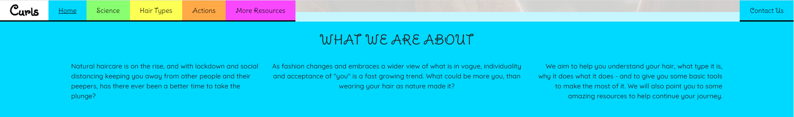
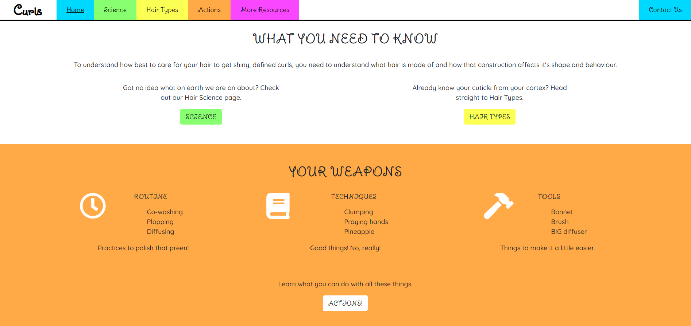
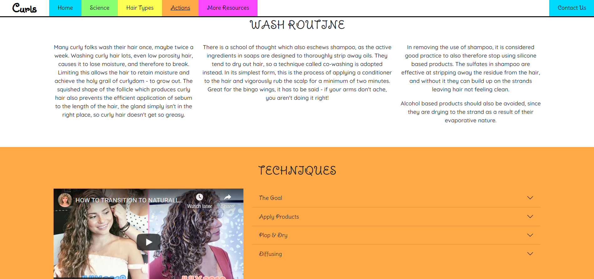
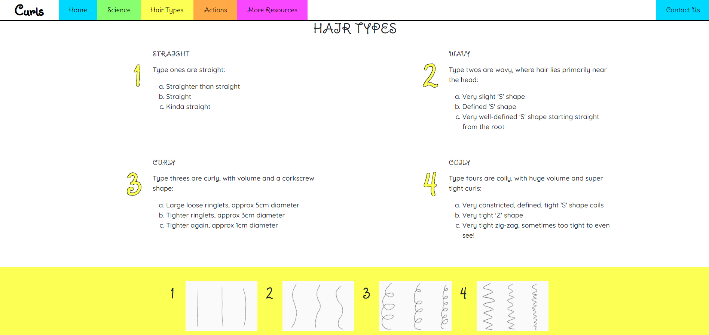
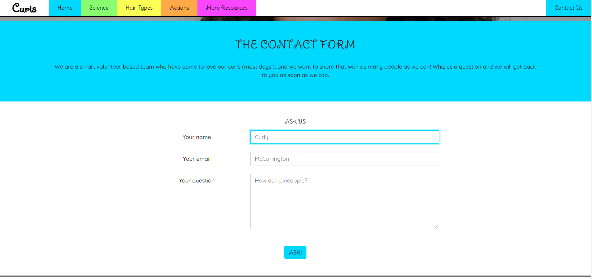

# **Curls**

## **Testing**

A plan and log for testing the website, this is a manual testing plan due to the limitations of the developer at this time, and the nature of the page.

# Index
1. [Validation Testing](#validation-testing)
1. [Logic Error Testing](#logic-error-testing)
1. [Client Stories Testing](#client-stories-testing)
1. [Manual Testing](#manual-testing)
    * [Common Elements](#common-elements)
    * [Page Specific Sections](#page-specific-sections)
      * [Home](#home)
      * [Science](#science)
      * [Hair Types](#hair-types)
      * [Actions](#actions)
      * [More Resources](#more-resources)
      * [Contact Us](#contact-us)
      * [404](#404)
1. [Bugs](#bugs)

## Validation Testing
The project code has been passed through the following code validators:
* [HTML Code Validator](https://validator.w3.org/)
* [CSS Code Validator](https://jigsaw.w3.org/css-validator/)

The project has been assessed throughout development using [Lighthouse](https://developers.google.com/web/tools/lighthouse).

## Logic Error Testing
1. Check that script to determine form validation and success feedback has no errors.
    * Script initially triggered invalid reference errors in Lighthouse and would not display.  Some experimentation determined that the script needed to be included after the link to the library.  As a beginner developer, JavaScript concepts are currently unknown and there is potential for further issues with this.
    * (See also [bugs](#bugs) section).
1. Check all pages for appropriate Bootstrap grid component ordering.
    * Hero boilerplate - missing col-12 in paragraph tag on all pages.
    * Home page - missing col-12 in div on rows 172/215/229.
    * Science page - section 1 had compenents without correct hierarchy.
    * Science page - missing col-12 in div on row 105.
    * Types page - no missing bootstrap classes but indentation corrected in section 1.
    * Actions page - added row and col-12 to section 3 on rows 223/224.
    * Actions page - also indentation corrected in section 2.
    * More page - no issues.
    * Contact page - missing col-12 on row 106.
    * (See also [bugs](#bugs) section).

## Client Stories Testing
1. As a new user, I want to quickly determine if the website contains information I need, so that I know quickly whether to stay on the page.
    1. The navigation bar is shown on every page with descriptive headings.
    1. The homepage has short summaries of each section including an overall synopsis.
    
1. As a new user, I want to easily determine and navigate to a point on the website which is appropriate for my existing knowledge, so that I do not waste time.
    1. The navigation bar is shown on every page with descriptive headings.
    1. The homepage has short summaries of each section.
    
1. As a new user, I want to learn about basic techniques that I can use right away, so that I can start putting research into action.
    1. The website is structured such that the user works through the pages Home > Science > Types > Actions, and the Actions page contains basic technique information.
    
1. As a returning user, I want to determine my hair type and porosity, so that I can tailor the techniques I learned before.
    1. The user can navigate to the Types page directly from any page on the website.
    
1. As a returning user, I want to be able to easily contact the site owners with questions, so that I can obtain tailored information or troubleshoot issues.
    1. There is a Contact page link in the Navigation bar on every page, shown separately from the rest of the nav.
    1. The contact form is as simple as possible.
    
1. As a frequent user, I want to be able to navigate quickly and easily to the relevant part of the website which contains the information I need, so that I can quickly fulfil the reason for my visit.
    1. All sections of the website are clearly linked to from the Navigation bar which is present on every page, either as shown on PC or in hamburger format.
    

## Manual Testing

### **Common Elements**

These components are present on every page, and each page has been tested.

---

#### Navigation Bar

**Intent** - a sticky navbar which collapses to hamburger on mobile.  Contact Us section should display clearly, separate from other elements in both nav bar and hamburger menu.

* All links are valid and link to the appropriate page.
* Logo alt displays on hover (added title attribute).
* Hover effect occurs correctly for each navigation section.
* Active class is applied correctly for current page.
* Resize to mobile/tablet and check that navigation bar collapses to hamburger.
* Expand hamburger menu and check all sections present, and displaying correctly.

**Result** - the navigation bar works as planned, being fully responsive across all device widths.  It was decided to collapse to hamburger at tablet rather than mobile to avoid the nav components appearing squashed. The Contact Us link displays clearly, separate from the other nav components, but remains within the nav section and is responsive accordingly. There is a remaining bug on the hamburger close-menu transition animation which causes part of it to appear left behind briefly.  See [bugs](#bugs) for more information.

**Verdict** - PASS

---

#### Hero Images

**Intent** - a full width image relevant to the page content, different for each page.  Primary purpose, to elicit a positive emotional response from the user.  The image should display correctly on all device sizes.  The image should display 100% height on the home page, 80% height on susequent pages to allow peep and 70% on the 404 page to display redirect information.

* Image fills the viewport/80/70 depending on page.
* Resize to mobile/tablet and check that image still displays the full window height without distortion.
* Text remains centered with no overflow at mobile/tablet.

**Result** - all seven images are fully responsive across various device types and widths, with no distortion or truncation.  The view height for each page is as expected.

**Verdict** - PASS

---

#### Footer

**Intent** - The footer should be reflective of the design of the nav to bookend each page and provide familiarity to the user.  This helps with intuitive learning.  The footer should display as two side by side sections on PC and tablet, then appear one beneath the other on mobile.  Social media links should open in new tabs and provide user feedback when hovered over.

* Footer appears in two equal sections.
* Social media icons display correctly, and show feedback behaviour on hover.
* Social links open in new tabs to correct locations.
* Resize to tablet and check for text overflow issues.
* Resize to mobile and check that sections wrap neatly below one another.

**Result** - Footer has plain black and white design with pops of colour from the social links.  This ties it to the header without distracting from the page content.  The responsive design behaves as expected across tested device widths.  Social media links open in new tabs, and display user feedback when hovered over.

**Verdict** - PASS

---

### **Page Specific Sections**

These items are specific to each individual page.

#### Basic Plan for Body Sections
* Check all areas of text align appropriately, horizontally and vertically.
* Check that behaviour is correct for mobile/tablet.
* Check that any links, buttons or fields show feedback behaviour on hover.
* Check that any links navigate to correct pages.
* Check that any external links open in a new tab, to the correct place.
* Check that any icons do not overflow into text on mobile/tablet.

---

#### Home

**Intent** - Provide a brief summary of the entire website in section one, followed by summaries for each page in subsequent sections, with links to the appropriate page.  The final section takes the user to the first page in a logical progression through the website.  Sections should be fully responsive and display clearly on devices of all sizes.

* All text sections and icons display correctly across tested device widths.
* All buttons and links display user feedback on hover.
* All internal links navigate to the correct page.
* All external links navigate to the correct page in a new tab.
* There was icon overflow on tablet as a result of incorrectly applied Bootstrap grid classes, this has been corrected.
* Center text area from section 1 is correctly not displayed on tablet, and displays correctly on mobile and PC.

**Result** - The page displays as expected across all tested device widths and all links behave correctly.  All user feedback is as expected.  There is no distortion of sections on mobile, tablet or PC.

**Verdict** - PASS

---

#### Science

**Intent** - Provide information in a beginner friendly format about the structure of hair and how it affects the degree of curl.  Information should be displayed in small digestible segments and supported by diagrams.

* All text sections and icons display correctly across tested device widths.
* All buttons display user feedback on hover.
* All internal links navigate to the correct page.
* There were div alignment issues in both section 1 and 2 as a result of incorrectly applied Bootstrap grid classes, this has been corrected.
* A coloured icon is displayed between text segments in section 1 on mobile to break up the large amount of text.  As expected, this does not display on tablet or PC.

**Result** - The page displays as expected across all tested device widths and all links behave correctly.  All user feedback is as expected.  There is no distortion of sections on mobile, tablet or PC.

**Verdict** - PASS

---

#### Hair Types

**Intent** - Provide information about the classification of curl types, and strand porosity, building on the information from the Science page.   Information should also be displayed in small digestible segments and supported by diagrams.

* All text sections and images display correctly across tested device widths.
* All buttons display user feedback on hover.
* All internal links navigate to the correct page.
* There were div alignment issues in section 1, particularly with the diagrams, as a result of incorrectly applied Bootstrap grid classes, this has been corrected.
* Numbered sections wrap correctly from linear on mobile to side by side on tablet and PC.

**Result** - The page displays as expected across all tested device widths and all links behave correctly.  All user feedback is as expected.  There is no distortion of sections on mobile, tablet or PC.

**Verdict** - PASS

---

#### Actions

**Intent** - Provide basic information regarding care which is consistent across all types of curly hair.  This page contains the most information, and therefore the most text.  Segments are still delivered in small digestible pieces to avoid overwhelming the user.

* All text sections and icons display correctly across tested device widths.
* All buttons and interactive elements display user feedback on hover or active state.
* All internal links navigate to the correct page.
* The div alignment issues in previous pages caused by incorrectly applied Bootstrap grid classes, was resolved and rectified while producing this page.
* A coloured icon is displayed between text segments in section 1 on mobile to break up the large amount of text.  As expected, this does not display on tablet or PC.

Embedded Video
* iframe displays correctly without squashing and is responsive to all device widths.
* Video loads paused so that the user can initiate interaction.

Accordion
* The accordion appears with all sections closed.
* The accordion segments show feedback on hover.
* The accordion segments expand fully with no overflow or truncation issues.
* The active accordion segment shows appropriate feedback behaviour.
* Only one accordion segment can be open at any time.
* Clicking an open accordion segment button closes the segment.
* Open accordion segments do not distort items further down the page.

**Result** - The page displays as expected across all tested device widths and all links and components behave correctly.  All user feedback is as expected.  There is no distortion of sections on mobile, tablet or PC.

**Verdict** - PASS

---

#### More Resources

**Intent** - Highlight that nothing is considered absolute in the curly haircare world by brifly discussing some of the biggest sources of conflict.  Provide links to further reading to help user continue research. All items delivered in small segments for ease of reading.

* All text sections and icons display correctly across tested device widths.
* Coloured icons used to break up the text on mobile and tablet correctly do not display on PC, and an icon used on PC correctly does not display on tablet or mobile.
* All buttons and links display user feedback on hover.
* All internal links navigate to the correct page.
* All external links navigate to the correct page in a new tab.
* User is guided to Contact page at the end of the section.

**Result** - The page displays as expected across all tested device widths and all links behave correctly.  All user feedback is as expected.  There is no distortion of sections on mobile, tablet or PC.

**Verdict** - PASS

---

#### Contact Us

**Intent** - Encourage the user to get in touch with the owners, and make it as easy as possible to do so.

* All text sections display correctly across tested device widths.
* All buttons display user feedback on hover.
* All internal links navigate to the correct page.

Contact Us Form
* Form contents align nicely and that there is no overflow of content.
* Fields display correctly on mobile/tablet and PC.
* Placeholder text displays in fields.
* Fields and submit button display feedback on hover.
* Fields display feedback on focus.
* Try to submit blank form, error messages display with information.
* Try to submit email in incorrect format, error message displays with information.
* Try to submit form without question, error message displays with information.
* Submit correctly completed form, receive success modal.
* Modal information centers correctly with no overflow on all device widths.

**Result** - The page displays as expected across all tested device widths and all links behave correctly.  All user feedback is as expected.  Form validation works properly, with successful submission notification only shown when all fields are completed.  There is no distortion of sections on mobile, tablet or PC.

**Verdict** - PASS

---

## Bugs

Details of any persistent or difficult bugs, and any bugs which remain unresolved.

### **Fixed Bugs**

#### Split Navigation Bar/menu
From the outset, it was felt that the Contact Us link in the nav should be separate from the other elements.  The other elements are all part of a logical progression and are primarily designed to deliver information, which the Contact page is not.  Additionally, the Contact page should be immediately identifiable and as the page grows in content, could be lost amongst the volume.

Trials with Bootstrap Grid worked really well, but it became apparent that the nav element and appropriate Bootstrap classes would be much better for accessibility and required for collapse to hamburger.  The Bootstrap nav components seem to work very differently from the rest of the grid.

A number of approaches were used to try to place the Contact page on the right of the screen, including:
* Float
* Text align
* Various flex classes and attributes as provided by Bootstrap
* Various grid alignment classes per Bootstrap documentation

Nothing moved the nav elements, or changed the alignment at all. Eventually position: absolute right: 0 was tried, which worked unexpectedly for both navbar and hamburger menu alignment, when there was an expectation that the desired hamburger menu position might need to be abandoned.

#### Bootstrap Class Hierarchy

Easily the biggest bugbear of this project were the issues caused by not fully understanding the Bootstrap grid components and the order in which they *must* be applied in order for weird things not to happen.

There were two main bugs caused by this. The most predominant was a narrow white overspill down the right side of the page which resulted in a horizontal scrollbar, regardless of size, but not always affecting all page sections. The other was the disappearance of the gutter on either the left or right side of a segment (never both) resulting in misaligned segments which were horribly obvious on mobile.

Whilst it was understood that every col *has* to have a parent row, it was not understood that every child of a row had to have a col class, or be a block element.  Additionally, the relationship of the container to the row and col classes was not understood to be as linear as it is.

#### Form Validation

The assessment handbook, and good UX design requires that feedback be given to the user on all interactions.  Browser validation for input fields in the Contact form were successfully activated by use of the required attribute, which satisfied this requirement for completion of the form fields.  On submitting a correctly completed form however, the page simply refreshed and no feedback was given.

A kind suggestion of [Eventyret/Simen Daehlin](https://github.com/Eventyret) was to create the positive feedback using a modal.  The modal boilerplate from Bootstrap was used to successfully generate a positive feedback popup, but ascthis switched the button type to button from submit, and meant that the form fields were no longer validated before submission.

The modal code classes and ID's were updated and the button type switched back to submit, however this simply resulted in the form validation error message and success modal appearing simultaneously.

[Eventyret/Simen Daehlin](https://github.com/Eventyret) had also shared a link to a README that they felt was a good template when answering a number of my queries.  In that README I noticed that the developer had experienced the exact same issue, and Eventyret had written a script which made the validation and modal popup appear correctly.

The code was copied into the contact page for this project (attributed in code and in README), and after much, much surmising and guessing the classes and ID's were aligned with those in this project but the script still didn't work.  Lighthouse displayed an Uncaught Reference Error, after much fruitless manipulation of classes and ID's, it was realised that a) there was no link to the library that the script required to work and b) the script had to sit beneath this library link in the HTML.

The form now validates properly, and the modal only displays when appropriate.

### **Remaining Bugs**

#### Hamburger collapse transition