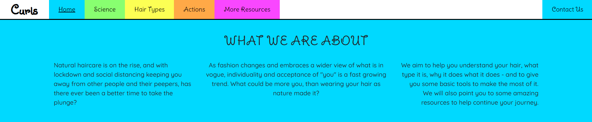
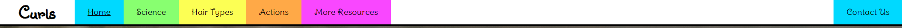

# **Curls**

## **Testing**

A plan and log for testing the website, this is a manual testing plan due to the limitations of the developer at this time, and the nature of the page.

# Index
1. [Validation Testing](#validation-testing)
1. [Client Stories Testing](#client-stories-testing)
1. [Manual Testing](#manual-testing)
    * [Plan](#plan-for-each-page)
    * [Home](#home)
    * [Science](#science)
    * [Types](#types)
    * [Actions](#actions)
    * [More Info](#more-info)
    * [Contact](#contact)

### **Validation Testing**
The project code has been passed through the following code validators:
* [HTML Code Validator](https://validator.w3.org/)
* [CSS Code Validator](https://jigsaw.w3.org/css-validator/)

The project has been assessed throughout development using [Lighthouse](https://developers.google.com/web/tools/lighthouse).

### **Client Stories Testing**
1. As a new user, I want to quickly determine if the website contains information I need, so that I know quickly whether to stay on the page.
    1. The navigation bar is shown on every page with descriptive headings.
    1. The homepage has short summaries of each section including an overall synopsis.
    
1. As a new user, I want to easily determine and navigate to a point on the website which is appropriate for my existing knowledge, so that I do not waste time.
    1. The navigation bar is shown on every page with descriptive headings.
    1. The homepage has short summaries of each section.
    
1. As a new user, I want to learn about basic techniques that I can use right away, so that I can start putting research into action.
    1. The website is structured such that the user works through the pages Home > Science > Types > Actions, and the Actions page contains basic technique information.
    
1. As a returning user, I want to determine my hair type and porosity, so that I can tailor the techniques I learned before.
    1. The user can navigate to the Types page directly from any page on the website.
    
1. As a returning user, I want to be able to easily contact the site owners with questions, so that I can obtain tailored information or troubleshoot issues.
    1. There is a Contact page link in the Navigation bar on every page, shown separately from the rest of the nav.
    1. The contact form is as simple as possible.
    
1. As a frequent user, I want to be able to navigate quickly and easily to the relevant part of the website which contains the information I need, so that I can quickly fulfil the reason for my visit.
    1. All sections of the website are clearly linked to from the Navigation bar which is present on every page, either as shown on PC or in hamburger format.
    

### **Manual Testing**

#### Plan for each page

* Navigation bar
  * Check that all links are valid and link to the appropriate page.
  * Check logo alt displays on hover.
  * Check that hover effect occurs correctly for each navigation section.
  * Check that active class is applied correctly for current page.
  * Resize to mobile/tablet and check that navigation bar collapses to hamburger.
  * Expand hamburger menu and check all sections present, and displaying correctly.

* Hero image
  * Check image fills the viewport/80/70 depending on page.
  * Resize to mobile/tablet and check that image still displays the full window height without distortion.
  * Check text remains centered with no overflow at mobile/tablet.

* Page specific sections
  * Check all areas of text align appropriately, horizontally and vertically.
  * Check that behaviour is correct for mobile/tablet.
  * Check that any links, buttons or fields show feedback behaviour on hover.
  * Check that any links navigate to correct pages.
  * Check that any external links open in a new tab, to the correct place.
  * Check that any icons do not overflow into text on mobile/tablet.

* Footer
  * Check that footer appears in two equal sections.
  * Check social media icons display correctly, and show feedback behaviour on hover.
  * Check that Social links open in new tabs to correct locations.
  * Resize to tablet and check for text overflow issues.
  * Resize to mobile and check that sections wrap neatly below one another.

* Embedded Video (Actions page only)
  * Check that iframe displays correctly without squashing and is responsive to all device widths.
  * Check that video loads paused so that the user can initiate interaction.

* Accordion (Actions page only)
  * Check that accordion appears with all sections closed.
  * Check that accordion segments show feedback on hover.
  * Check that accordion segments expand fully with no overflow or truncation issues.
  * Check that active accordion segment shows appropriate feedback behaviour.
  * Check that only one accordion segment can be open at any time.
  * Check that clicking an open accordion segment button closes the segment.
  * Check that open accordion segments do not distort items further down the page.

* Contact Us Form (Contact Us page only)
  * Check form contents align nicely and that there is no overflow of content.
  * Check fields display correctly on mobile/tablet.
  * Check placeholder text displays in fields.
  * Check fields and submit button display feedback on hover.
  * Check fields display feedback on focus.
  * Try to submit blank form, check error messages display with information.
  * Try to submit email in incorrect format, check error message displays with information.
  * Try to submit form without question, check error message displays.
  * Submit correctly completed form, receive success modal.
  * Check modal information centers pleasingly with no overflow on all device widths.